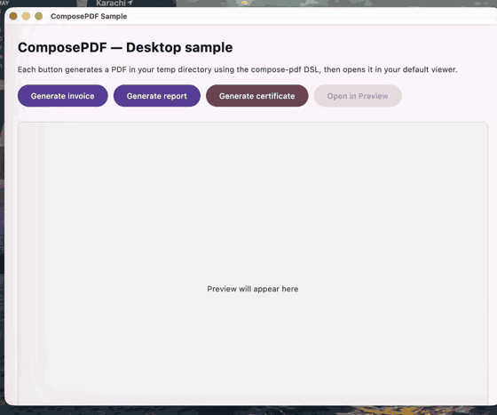

# ComposePDF

**A PDF document builder for Compose Multiplatform apps.** A small, Compose-style DSL for
laying out multi-page PDFs — text, shapes, lines, and images — with selectable text and real
vector output. Apache PDFBox under the hood; produces standards-compliant PDFs.

[](https://central.sonatype.com/artifact/io.github.nadeemiqbal/compose-pdf)
[](LICENSE)
[](https://github.com/NadeemIqbal/compose-pdf/actions/workflows/build.yml)

<p align="center">
  
</p>

## Why

Generating a PDF from a CMP / Kotlin Desktop app today means one of three painful paths:

| Existing | Problem |
|---|---|
| Call out to a Java PDF library directly (iText / PDFBox) | Imperative + verbose; coords are bottom-up; no Compose idiom |
| Render Compose → bitmap → embed in PDF | Loses selectable text + vector quality; huge file sizes |
| HTML → headless-browser → PDF | Heavy runtime; flaky output across machines |

ComposePDF wraps PDFBox in a small Compose-style scope DSL — `pdfDocument { page { ... } }` —
with top-down coordinates, `Color` from `compose.ui`, and an API surface that maps cleanly
onto how you already think about layout. Real vector output. Text is selectable. Tiny files.

## Install

```kotlin
dependencies {
    implementation("io.github.nadeemiqbal:compose-pdf:0.1.0")
}
```

## Hello, world

```kotlin
val pdf: ByteArray = pdfDocument {
    page {
        text("Invoice #2026-0042", x = 50f, y = 50f, fontSize = 24f, bold = true)
        line(50f, 75f, 545f, 75f)
        text("Total: $1,234.56", x = 50f, y = 110f, fontSize = 14f)
    }
}
File("invoice.pdf").writeBytes(pdf)
```

That's it. Open `invoice.pdf` in any viewer — text is selectable, vectors are crisp at any
zoom level, file is ~1.5 KB.

## Multi-page + page sizes

```kotlin
val pdf = pdfDocument(defaultPageSize = PdfPageSize.A4) {
    page { /* defaults to A4 portrait */ }
    page(size = PdfPageSize.Letter) { /* override per page */ }
    page(size = PdfPageSize.A4.landscape()) { /* rotated */ }
}
```

Predefined: `A3`, `A4`, `A5`, `Letter`, `Legal`, `Tabloid`. For custom:
`PdfPageSize.mm(210f, 297f)` or `PdfPageSize.inches(8.5f, 11f)`.

## The drawing API

Inside a `page { ... }` you get a `PdfPageScope` with these primitives:

```kotlin
page {
    // Text — (x, y) is the baseline of the first glyph
    text("Hello", x = 50f, y = 50f, fontSize = 14f, color = Color.Black, bold = false)

    // Filled / stroked rectangle (pass null to either to skip that pass)
    rect(50f, 100f, width = 200f, height = 80f, fillColor = Color(0xFFE3F2FD))
    rect(50f, 200f, width = 200f, height = 80f, strokeColor = Color.Black, strokeWidth = 2f)

    // Single line
    line(50f, 320f, 545f, 320f, color = Color.Red, strokeWidth = 1f)

    // Embedded image (ImageBitmap → PDImageXObject)
    image(bitmap, x = 50f, y = 360f, width = 200f, height = 200f)
}
```

Coordinates: origin is **top-left**, y increases **downward** — matching how you already
think about Compose layout. The library handles the PDFBox bottom-up flip internally.

## Bar chart from primitives

```kotlin
page(size = PdfPageSize.A4) {
    text("Tickets shipped per month", x = 40f, y = 60f, fontSize = 18f, bold = true)

    val data = listOf("Jan" to 18, "Feb" to 22, "Mar" to 31, "Apr" to 28, "May" to 35)
    val (chartL, chartT, chartH, barW, gap, maxV) =
        listOf(60f, 130f, 280f, 50f, 30f, 40)
    line(chartL, chartT + chartH, chartL + 480f, chartT + chartH, Color.Black)
    line(chartL, chartT, chartL, chartT + chartH, Color.Black)
    data.forEachIndexed { i, (label, value) ->
        val h = (value.toFloat() / maxV) * (chartH - 20f)
        val x = chartL + 10f + i * (barW + gap)
        rect(x, chartT + chartH - h, barW, h, fillColor = Color(0xFF1976D2))
        text(label, x + 12f, chartT + chartH + 18f, fontSize = 11f)
        text(value.toString(), x + 14f, chartT + chartH - h - 6f, fontSize = 10f, bold = true)
    }
}
```

No layout engine, no templating language — just direct vector commands. See
`sample/desktopApp` for a fuller example (invoice + multi-page report + certificate).

## Sample app

```bash
./gradlew :sample:desktopApp:run
```

Three buttons: **Generate invoice**, **Generate report**, **Generate certificate**. Each
generates a real PDF in your temp directory and opens it in your default viewer.

## Platforms

| Target | Status |
|---|---|
| Desktop (JVM 11) | ✅ |
| iOS (x64, arm64, simulatorArm64) | ⏳ v0.2 |
| Web (wasmJs) | ⏳ v0.2 |
| Android (minSdk 24) | ⏳ v0.2 |

v0.1 targets Desktop / JVM only — it uses **Apache PDFBox 3.0.5** under the hood
(~5 MB, Apache 2.0). iOS / Web / Android are planned for v0.2 once Skiko's `PDFDocument`
bindings stabilise in the public Kotlin API (they're not exposed as of Skiko 0.10).

## Why Desktop-only for v0.1?

Skia (and therefore Skiko) ships a `SkPDFDocument` backend that would let this library run on
every CMP target — but the Kotlin bindings (`org.jetbrains.skia.pdf.PDFDocument`) are not in
the public API as of Skiko 0.10. Rather than bundle a fork, v0.1 ships with a rock-solid
JVM-native backend (PDFBox) and ports to iOS / Web / Android land in v0.2 once Skiko exposes
the PDF API publicly. The DSL itself is in `commonMain` — only the actual implementation is
platform-specific, so v0.2 will be a drop-in upgrade for existing call sites.

## License

Apache 2.0 — see [LICENSE](LICENSE).
